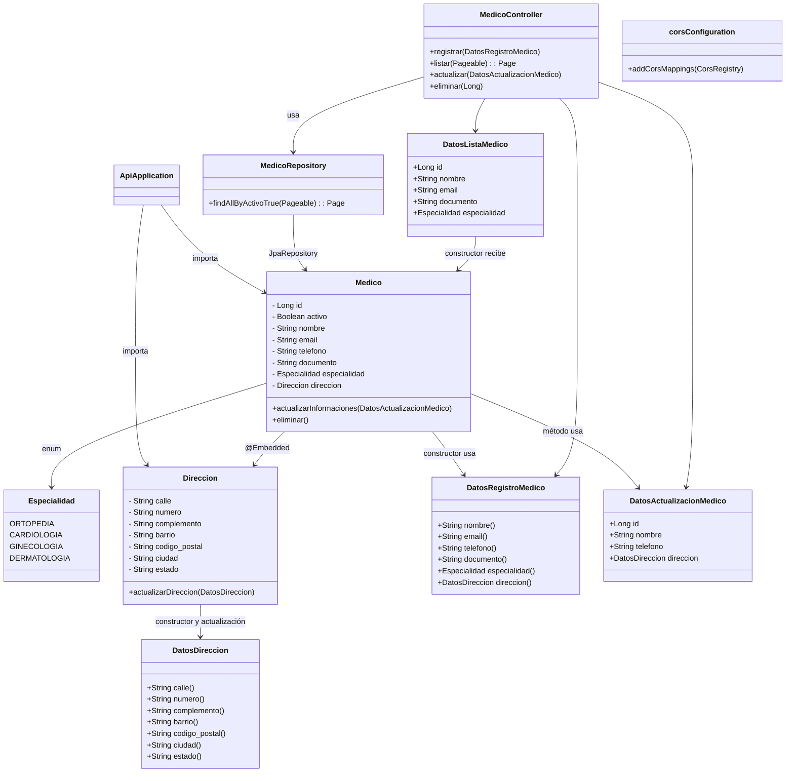

```mermaid
classDiagram
    direction TB

    %% ==== CONTROLADORES ====
    class MedicoController {
        +registrar(DatosRegistroMedico)
        +listar(Pageable): Page<DatosListaMedico>
        +actualizar(DatosActualizacionMedico)
        +eliminar(Long)
    }

    %% ==== CONFIGURACIÓN ====
    class corsConfiguration {
        +addCorsMappings(CorsRegistry)
    }

    %% ==== ENTIDAD PRINCIPAL ====
    class Medico {
        - Long id
        - Boolean activo
        - String nombre
        - String email
        - String telefono
        - String documento
        - Especialidad especialidad
        - Direccion direccion
        +actualizarInformaciones(DatosActualizacionMedico)
        +eliminar()
    }

    %% ==== ENUM ====
    class Especialidad {
        ORTOPEDIA
        CARDIOLOGIA
        GINECOLOGIA
        DERMATOLOGIA
    }

    %% ==== EMBEBIDA ====
    class Direccion {
        - String calle
        - String numero
        - String complemento
        - String barrio
        - String codigo_postal
        - String ciudad
        - String estado
        +actualizarDireccion(DatosDireccion)
    }

    %% ==== REPOSITORY ====
    class MedicoRepository {
        +findAllByActivoTrue(Pageable): Page<Medico>
    }

    %% ==== DTOs ====
    class DatosRegistroMedico {
        +String nombre()
        +String email()
        +String telefono()
        +String documento()
        +Especialidad especialidad()
        +DatosDireccion direccion()
    }

    class DatosListaMedico {
        +Long id
        +String nombre
        +String email
        +String documento
        +Especialidad especialidad
    }

    class DatosActualizacionMedico {
        +Long id
        +String nombre
        +String telefono
        +DatosDireccion direccion
    }

    class DatosDireccion {
        +String calle()
        +String numero()
        +String complemento()
        +String barrio()
        +String codigo_postal()
        +String ciudad()
        +String estado()
    }

    %% ==== APLICACIÓN ====
    class ApiApplication

    %% ==== RELACIONES ====
    MedicoController --> MedicoRepository : usa
    MedicoController --> DatosRegistroMedico
    MedicoController --> DatosListaMedico
    MedicoController --> DatosActualizacionMedico

    Medico --> Direccion : @Embedded
    Medico --> Especialidad : enum
    Medico --> DatosRegistroMedico : constructor usa
    Medico --> DatosActualizacionMedico : método usa

    Direccion --> DatosDireccion : constructor y actualización

    DatosListaMedico --> Medico : constructor recibe

    MedicoRepository --> Medico : JpaRepository

    ApiApplication --> Medico : importa
    ApiApplication --> Direccion : importa

```