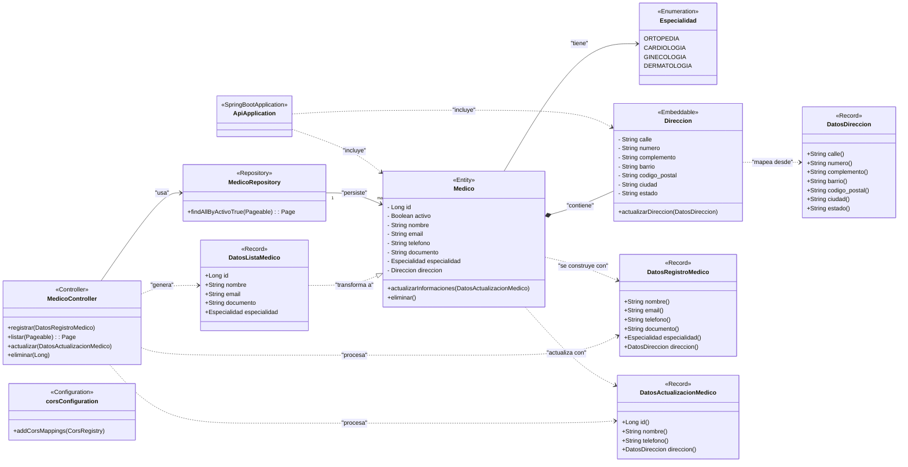

# Medicina Alura Latam

## Descripción

Este es un trabajo realizado en Alura Latam en el cual vamos a ir siguiendo el curso paso a paso, y lo vamos a ir documentando como modo de aprendizaje y práctica.  
Este proyecto está 100% enfocado en el backend.

##

## ¿Qué es Spring Boot y por qué utilizarlo?

Spring Boot es un framework basado en Spring que facilita la creación rápida de aplicaciones Java robustas y listas para producción, con configuración automática, servidor embebido y muchas herramientas listas para usar.

##

## Herramientas utilizadas

- **Spring Boot 3**: Framework para desarrollo backend rápido y confiable en Java.
- **Java 17**: Versión LTS con mejoras en rendimiento, seguridad y nuevas características.
- **Lombok**: Reduce código repetitivo generando getters, setters, constructores, etc.
- **MySQL / Flyway**: MySQL como base de datos relacional; Flyway para migraciones y versionado de esquema.
- **JPA / Hibernate**: API y framework para mapeo objeto-relacional (ORM).
- **Maven**: Herramienta para gestión de proyectos y dependencias.
- **Insomnia**: Cliente REST para probar y depurar APIs.
- **Figma**: Herramienta para diseño y prototipado UI/UX.

---

## Versiones LTS / ¿Qué son?

Las versiones LTS (Long Term Support) son versiones con soporte extendido y actualizaciones de seguridad por varios años.  
Se recomienda usarlas en producción para mayor estabilidad.

##

## Nomenclatura de comentarios de Git

| Prefijo   | Descripción                                         |
| --------- | ------------------------------------------------- |
| `feat:`   | Nueva funcionalidad                                |
| `fix:`    | Corrección de bugs                                 |
| `docs:`   | Cambios en documentación                           |
| `style:`  | Cambios de formato (no funcionales)               |
| `refactor:` | Reestructuración de código                       |
| `test:`   | Añadir o mejorar pruebas                           |
| `chore:`  | Tareas menores (actualizar dependencias, config) |

##

## Instalación y Ejecución

Para correr el proyecto backend:

```bash
./mvnw clean install
./mvnw spring-boot:run
```

