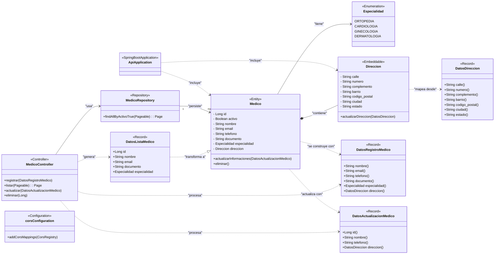

```mermaid
classDiagram
    direction LR

    %% ==== CONTROLADORES ====
    class MedicoController {
        <<Controller>>
        +registrar(DatosRegistroMedico)
        +listar(Pageable): Page<DatosListaMedico>
        +actualizar(DatosActualizacionMedico)
        +eliminar(Long)
    }

    %% ==== CONFIGURACIÓN ====
    class corsConfiguration {
        <<Configuration>>
        +addCorsMappings(CorsRegistry)
    }

    %% ==== APLICACIÓN ====
    class ApiApplication {
        <<SpringBootApplication>>
    }

    %% ==== ENTIDAD PRINCIPAL ====
    class Medico {
        <<Entity>>
        - Long id
        - Boolean activo
        - String nombre
        - String email
        - String telefono
        - String documento
        - Especialidad especialidad
        - Direccion direccion
        +actualizarInformaciones(DatosActualizacionMedico)
        +eliminar()
    }

    %% ==== ENUM ====
    class Especialidad {
        <<Enumeration>>
        ORTOPEDIA
        CARDIOLOGIA
        GINECOLOGIA
        DERMATOLOGIA
    }

    %% ==== EMBEBIDA ====
    class Direccion {
        <<Embeddable>>
        - String calle
        - String numero
        - String complemento
        - String barrio
        - String codigo_postal
        - String ciudad
        - String estado
        +actualizarDireccion(DatosDireccion)
    }

    %% ==== REPOSITORY ====
    class MedicoRepository {
        <<Repository>>
        +findAllByActivoTrue(Pageable): Page<Medico>
    }

    %% ==== DTOs ====
    class DatosRegistroMedico {
        <<Record>>
        +String nombre()
        +String email()
        +String telefono()
        +String documento()
        +Especialidad especialidad()
        +DatosDireccion direccion()
    }

    class DatosActualizacionMedico {
        <<Record>>
        +Long id()
        +String nombre()
        +String telefono()
        +DatosDireccion direccion()
    }

    class DatosListaMedico {
        <<Record>>
        +Long id
        +String nombre
        +String email
        +String documento
        +Especialidad especialidad
    }

    class DatosDireccion {
        <<Record>>
        +String calle()
        +String numero()
        +String complemento()
        +String barrio()
        +String codigo_postal()
        +String ciudad()
        +String estado()
    }

    %% ==== RELACIONES MEJORADAS ====
    MedicoController --> MedicoRepository : "usa"
    MedicoController ..> DatosRegistroMedico : "procesa"
    MedicoController ..> DatosActualizacionMedico : "procesa"
    MedicoController ..> DatosListaMedico : "genera"

    Medico *-- Direccion : "contiene"
    Medico --> Especialidad : "tiene"
    Medico ..> DatosRegistroMedico : "se construye con"
    Medico ..> DatosActualizacionMedico : "actualiza con"

    Direccion ..> DatosDireccion : "mapea desde"

    DatosListaMedico ..|> Medico : "transforma a"

    MedicoRepository "1" --> "many" Medico : "persiste"

    ApiApplication ..> Medico : "incluye"
    ApiApplication ..> Direccion : "incluye"
```